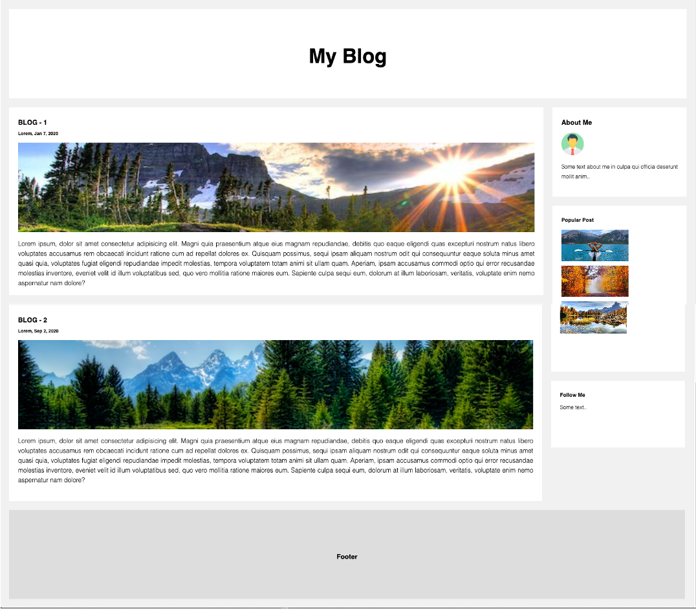

# Grid Blogger

Using your CSS Grid skills, recreate the blog page in the reference image below

## Layout design

- As a bonus, make the site fully responsive

[click...!](https://silvaoscar.github.io/Blog/)
